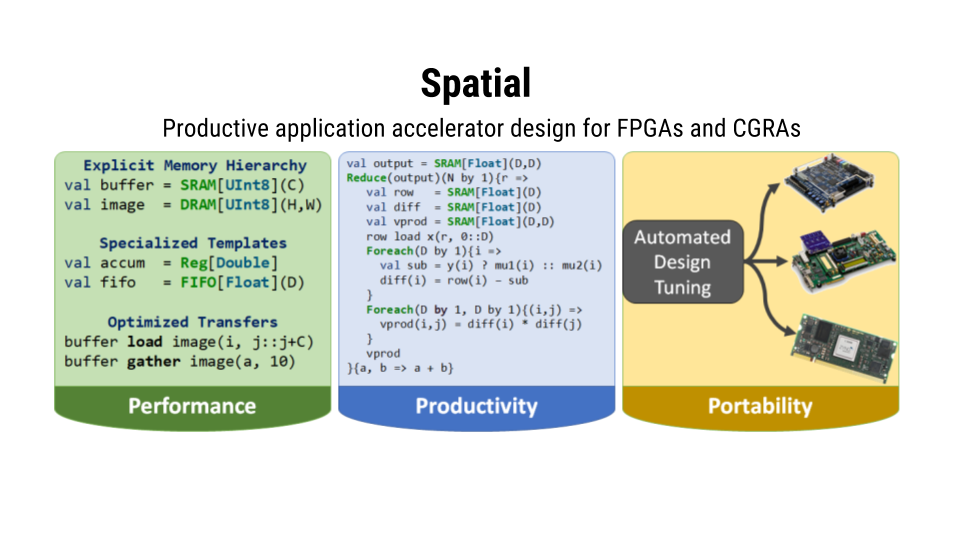

+------------------------------------------+------------------------------------+
| :doc:`Get Started <tutorial/starting>`   | :doc:`API Documentation <api>`     |
+------------------------------------------+------------------------------------+

Spatial is a domain-specific language for describing hardware accelerators for use on FPGAs and other supported spatial architectures.
The language is intended to be both higher level than hardware description languages (HDLs) like Verilog, VHDL, and `Chisel <https://chisel.eecs.berkeley.edu/>`_,
while also being easier to use than Altera's OpenCL or high level synthesis (HLS) languages like Xilinx's Vivado.

Language features of Spatial include:
   * Tunable, hardware specific templates
   * User specified and implicitly created design parameters
   * Design runtime and area analysis
   * Automatic parameter tuning
   * Automatic memory banking and buffering

.. To run Spatial on the new Amazon EC2 FPGA instances, see :doc:`the AWS Tutorial <aws/intro>`.

.. toctree::
   :maxdepth: 1

   api
   tutorial
   examples
   .. aws
   theory