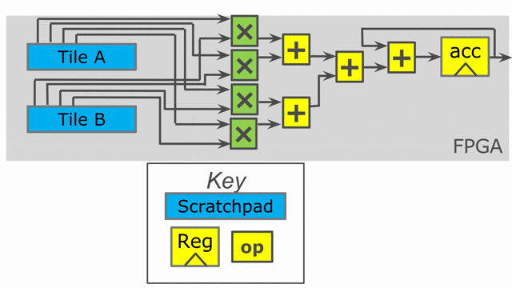

1. Vector Inner Product
=======================

Catalog of Features
-------------------

In this section, you will learn about the following components in Spatial:

 - Tiling

 - Reduce and Fold

 - Sequential execution and Coarse-grain pipelining
 
 - Parallelization
 
 - Basic buffering and banking

Application Overview
--------------------

Inner product (also called dot product) is an extremely simple linear algebra kernel, defined as the
sum of the element-wise products between two vectors of data. For this example, we'll assume that the
data in this case are 32-bit signed fixed point numbers with 8 fractional bits. You could, however, 
also do the same operations with custom struct types.  

Data Setup and Validation
-------------------------

Let's start by creating the data structures above the Accel that we will compute the dot product on. We will expose
the length of these vectors as a command-line argument. We will also write the code below the Accel to ensure we have
the correct result::
  
    import spatial.dsl._
    import virtualized._

    object DotProduct extends SpatialApp {

      @virtualize
      def main() {

    type T = FixPt[TRUE,_24,_8]
    
    val N = args(0).to[Int]
    val length = ArgIn[Int]
    setArg(length, N)
    val result = ArgOut[T]
    
    val vector1_data = Array.tabulate(N){i => random[T](5)}
    val vector2_data = Array.tabulate(N){i => random[T](5)}

    val vector1 = DRAM[T](length) // DRAMs can be sized by ArgIns
    val vector2 = DRAM[T](length)

    setMem(vector1, vector1_data)
    setMem(vector2, vector2_data)

    Accel {}
    
    val result_dot = getArg(result)
    val gold_dot = vector1_data.zip(vector2_data){_*_}.reduce{_+_}
    val cksum = gold_dot == result_dot
    println("Received " + result_dot + ", wanted " + gold_dot)
    println("Pass? " + cksum)
      }

Tiling and Reduce/Fold
----------------------

Now we will focus our attention on writing the accelerator code.  We must first figure out how to process a variable-sized
vector on a fixed hardware design.  To do this, we use tiling.  Let's create a val for the tileSize just inside the ``main()`` 
method::

  val tileSize = 64

Now we can break the vectors into 64-element chunks, and then process these chunks locally on the FPGA using the ``Reduce`` 
construct::
  
    Accel {
      result := Sequential.Reduce(Reg[T](0))(length by tileSize){tile => // Returns Reg[T], writes to ArgOut
        val tile1 = SRAM[T](tileSize)
        val tile2 = SRAM[T](tileSize)

        tile1 load vector1(tile :: tile + tileSize)
        tile2 load vector2(tile :: tile + tileSize)

            val local_accum = Reg[T](0)
        Reduce(local_accum)(tileSize by 1){i => tile1(i) * tile2(i)}{_+_} // Accumulates directly into local_accum
            local_accum
      }{_+_}
    }

It might seem a bit odd at first that we have the line `{_+_}` twice in this app. This is because the inner reduce accumulates over a tile, and the outer reduce
accumulates each result we get from each tile.  The ``Reduce`` construct assumes that the register that is doing the accumulation will
effectively reset on each iteration of its parent controller.  This means that on the first iteration of the innermost reduce, the hardware
will write the first product directly to the register. On the second iteration of this innermost reduce, it will write the current value of local_accum
PLUS the next product.  This means that if local_accum were declared to have an initial value of 5, reducing on top of it will start at 0, not 5.

Also, notice the ``Sequential`` modifier on the outer reduce loop.  This ensures that everything inside of this loop will happen sequentially and without
coarse-grained pipelining.  We will play more with this parameter in the next section, `Pipelining and Parallelization`_.

The ``Reduce`` construct takes four pieces of information: **1)** an existing Reg or a new Reg in which to accumulate, 
**2)** a range and step for its counter to scan, **3)** a map function, and **4)** a reduce function.  If a new Reg is declared
inside the ``Reduce``, then the structure returns this register.  Importantly, note that a declaration of ``val local_accum = Reg[T](0)`` does not
mean that local_accum is reset on every iteration.  This is a declaration of hardware and is always present.  It is the contract
implicit with the ``Reduce`` construct that effectively resets the register.  You can manually reset the register in the code with
``local_accum.reset``.

Alternatively, you can express the Accel for dot product using a ``Fold``.  This is similar to a ``Reduce``, except the Reg
is persistent and not reset unless explicitly reset by the user.  In the case where a Reg was declared to have an initial value of
5, the Fold on top of this Reg would start at 5 and not 0.  The code would look like this::

    Accel {
        val accum = Reg[T](0)
        Sequential.Foreach(length by tileSize){tile =>
            val tile1 = SRAM[T](tileSize)
            val tile2 = SRAM[T](tileSize)

            tile1 load vector1(tile :: tile + tileSize)
            tile2 load vector2(tile :: tile + tileSize)

            Fold(accum)(tileSize by 1){i => tile1(i) * tile2(i)}{_+_} 
        }
        result := accum
    }

Let's take a look at the hardware we have generated.  The animation below demonstrates how this code
will synthesize and execute.

.. image:: dotseq.gif

While the above code appears to be correct, there is a problem when handling edge-cases.  If
the user inputs a vector size that is not a multiple of our tileSize, then we will have an issue
with the above code on the final iteration.  

To fix this, we need to keep track of how many elements we `actually` want to reduce over each time
we execute the inner pipe::

    Accel {
        val accum = Reg[T](0)
        Sequential.Foreach(length by tileSize){tile =>
            val numel = min(tileSize.to[Int], length - tile)
            val tile1 = SRAM[T](tileSize)
            val tile2 = SRAM[T](tileSize)

            tile1 load vector1(tile :: tile + numel)
            tile2 load vector2(tile :: tile + numel)

            Fold(accum)(numel by 1){i => tile1(i) * tile2(i)}{_+_} 
        }
        result := accum
    }

Pipelining and Parallelization
------------------------------

Now we will look into ways to speed up the application we have written above.  

The first technique is to pipeline the algorithm.  In the animation in the previous section,
you will notice that the entire hardware is working on one tile at a time.  It is possible to
pipeline this algorithm at a coarse level such that we overlap the tile loading with the 
computation.  While this boils down to a "prefetching" operation in this particular design,
Spatial allows you to arbitrarily pipeline any operations you have in your algorithm and at
any level and over any depth.

In order to exploit this technique, you simply need to remove the ``Sequential`` modifier on 
the outer loop.  By default, all controllers will pipeline their children controllers if no
modifiers are added.  In this dot product, there are two child stages inside the outer pipe 
(parallel load of tiles 1 and 2 is the first stage, and reduction over the tiles is the second 
stage).  This kind of coarse-grain pipeline is implemented using asynchronous handshaking signals
between each child stage and their respective parent.  The resulting code looks like this::

    Accel {
        val accum = Reg[T](0)
        Foreach(length by tileSize){tile =>
            val numel = min(tileSize.to[Int], length - tile)
            val tile1 = SRAM[T](tileSize)
            val tile2 = SRAM[T](tileSize)

            tile1 load vector1(tile :: tile + numel)
            tile2 load vector2(tile :: tile + numel)

            Fold(accum)(numel by 1){i => tile1(i) * tile2(i)}{_+_} 
        }
        result := accum
    }

This code is expressed in the following animation. Notice that the on-chip SRAM is now larger
as it consists of a double buffer.  This buffer is what protects one stage of the pipeline from 
the next.  In order to load the next tile into memory, we must retain the data from the previous tile
in such a way that the second stage can consume it.  While this pipelining improves performance,
it consumes more area.  Spatial will automatically buffer all SRAMs, Regs, and RegFiles for the user up
to whatever depth is required to guarantee correctness.  Note that while it is not shown in the animation,
the accumulating register is also duplicated, such that one of the duplicates is a double buffer to
guarantee correctness for its reader. 

.. image:: dotpipe.gif

We will now look at parallelization as another technique to speed up the algorithm.  We will return
to the version that uses two ``Reduce`` nodes rather than the version that uses the ``Fold``, and this
switch will make sense by the end of the tutorial.  

You can think of parallelization of a controller as extending the counter value to hold multiple
consecutive values at once.  Specifically, if we parallelize the innermost controller, whose
counter value is captured by the variable ``i``, then this ``i`` no longer holds a single value.
It becomes a vector of consecutive values. If the parallelization is set to 4, then it will hold 4 
consecutive values and the controller will complete its execution in a quarter of the time.

Because ``i`` is used to index into our SRAMs, we need to physically bank our memories in order
to ensure that we can read all of the requested values at the same time.  The scratchpad memories
on-chip have a single write port and a single read port, but the language allows the user to
read and write to a memory at will.  The Spatial compiler figures out the physical banking, muxing, and duplication
of memories that is necessary to ensure the user gets the correct logical behavior specified in the application.
The compiler also generates the necessary reduction tree and parallel hardware required to feed
the reduction loop.  The animation below demonstrates this innermost parallelization.

Finally, the language also exposes parallelization at controllers beyond the innermost ones.  In this particular application,
the outer ``Reduce`` can be parallelized, enabling us to operate on multiple tiles at the same time in parallel.  When
loops containing other controllers and operations are parallelized, the compiler automatically unrolls the body and duplicates
whatever hardware is necessary.  It routes the proper lanes of the counter to each of the unrolled bodies and executes them 
in parallel.  Below is an animation depicting this mode of operation.

.. image:: dotopar.gif

Notice that the accumulator in stage 2 is now double-buffered.  This is because the final reduction stage of the outer reduce
is actually viewed as a third stage in the hierarchical control scheme.  This means that we need to protect whatever value is
in the accumulator when the buffer switches and the third stage prepares to reduce and consume the partial sums.

The reason we could not use the ``Fold`` version with outer parallelization is because it would require us to have multiple
controllers all competing to write to the same register.  When there is outer-level parallelization, anything declared inside
the body of the controller goes along for the ride when unrolled.  This is why we must declare the SRAMs inside of the outer loop.
In the case of the ``Fold`` app, we had to declare the accumulator above the outer loop so that it is visible at the end when
we write the result to the ArgOut.  Using an outer reduce lets us work on multiple tiles in parallel and merge their results in 
the final stage of the controller.

Final Code
----------

Finally, below is the complete app that includes all of the performance-oriented features outlined in this page of the tutorial.
Refer back to the `targets <../targets.html>`_ section for a refresher on how to test your app.::

    import spatial.dsl._
    import virtualized._

    object DotProduct extends SpatialApp {

      @virtualize
      def main() {

        type T = FixPt[TRUE,_24,_8]
        val tileSize = 64
        
        val N = args(0).to[Int]
        val length = ArgIn[Int]
        setArg(length, N)
        val result = ArgOut[T]
        
        val vector1_data = Array.tabulate(N){i => random[T](5)}
        val vector2_data = Array.tabulate(N){i => random[T](5)}

        val vector1 = DRAM[T](length) // DRAMs can be sized by ArgIns
        val vector2 = DRAM[T](length)

        setMem(vector1, vector1_data)
        setMem(vector2, vector2_data)

        Accel {
            result := Reduce(Reg[T](0))(length by tileSize par 2){tile =>
                val numel = min(tileSize.to[Int], length - tile)
                val tile1 = SRAM[T](tileSize)
                val tile2 = SRAM[T](tileSize)

                tile1 load vector1(tile :: tile + numel)
                tile2 load vector2(tile :: tile + numel)

                Reduce(Reg[T](0))(numel by 1 par 4){i => tile1(i) * tile2(i)}{_+_} 
            }{_+_}
        }
        
        val result_dot = getArg(result)
        val gold_dot = vector1_data.zip(vector2_data){_*_}.reduce{_+_}
        val cksum = gold_dot == result_dot
        println("Received " + result_dot + ", wanted " + gold_dot)
        println("Pass? " + cksum)
      }
    }

When you understand the concepts introduced in this page, you may move on to the next example, :doc:`gemm`, where you
will learn to perform reductions on memories, include instrumentation hooks to help balance your pipeline,
and see more complicated examples of banking.
