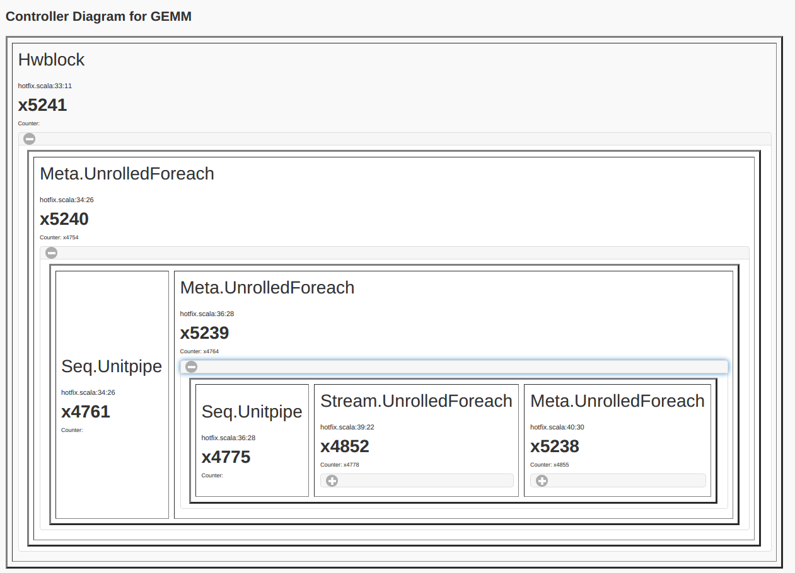
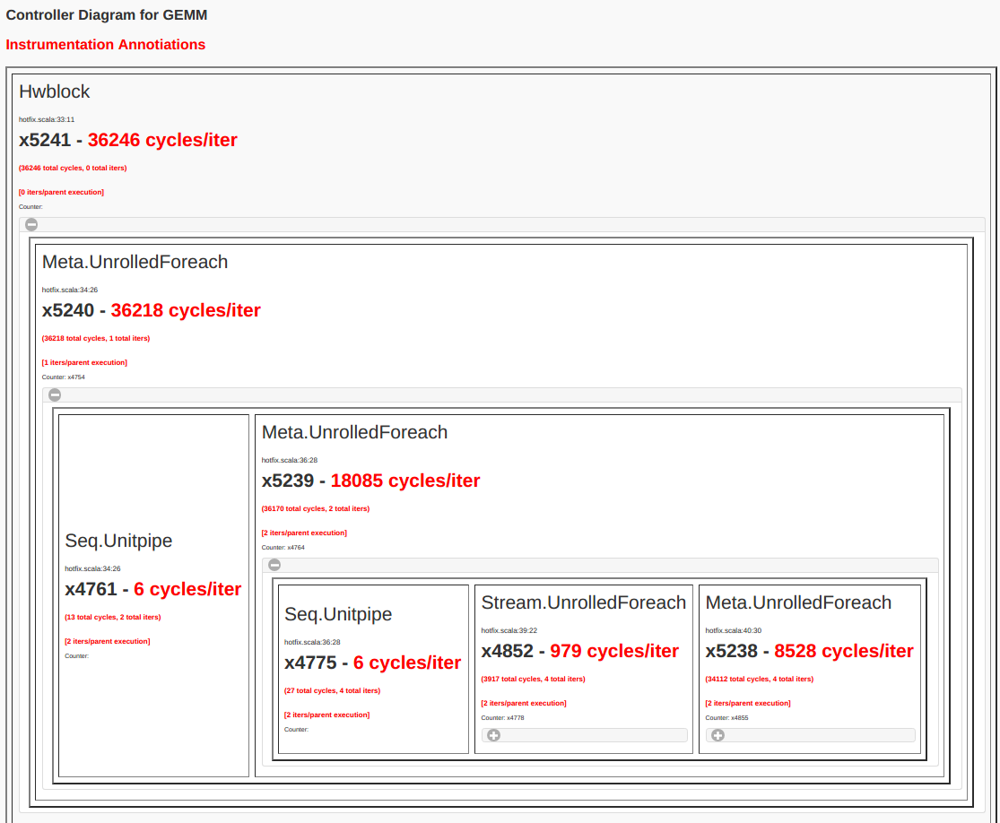

3. General Matrix Multiply (GEMM)
=================================

Catalog of Features
-------------------

In this section, you will learn about the following components in Spatial:

 - MemReduce and MemFold

 - Instrumentation Hooks

 - Advanced Banking

 - Advanced Buffering
 

Application Overview
--------------------

General Matrix Multiply (GEMM) is a common algorithm in linear algebra, machine learning,
statistics, and many other domains.  It provides a more interesting trade-off space than
the previous tutorial, as there are many ways to break up the computation.  This includes
using blocking, inner products, outer products, and systolic array techniques.  In this tutorial,
we will demonstrate how to build a blocked GEMM app that uses outer products, and leave it to the
user to try and build a GEMM version that uses inner products.  Later tutorials will show how
to use shift registers and systolic arrays in other applications, but the same techniques can
be retroactively applied to this tutorial on GEMM as well.

Data Setup and Validation
-------------------------

Let's start by creating the data structures above the Accel that we will set up the matrices and compute the 
gold check. We will expose the dimensions of the matrices as command-line arguments. ::
	
    import spatial.dsl._
    import org.virtualized._

    object GEMM extends SpatialApp {

      @virtualize
      def main() {

		type T = FixPt[TRUE,_24,_8]

		// Mxk * KxN = MxN 
	    val M = ArgIn[Int]
	    val N = ArgIn[Int]
	    val K = ArgIn[Int]
	    setArg(M,args(0).to[Int])
	    setArg(N,args(1).to[Int])
	    setArg(K,args(2).to[Int])

	    val a_data = (0::args(0).to[Int], 0::args(2).to[Int]){(i,j) => random[T](3)}
	    val b_data = (0::args(2).to[Int], 0::args(1).to[Int]){(i,j) => random[T](3)}
	    val c_init = (0::args(0).to[Int], 0::args(1).to[Int]){(i,j) => 0.to[T]}
	    val a = DRAM[T](M, K)
	    val b = DRAM[T](K, N)
	    val c = DRAM[T](M, N)

	    setMem(a, a_data)
	    setMem(b, b_data)
	    setMem(c, c_init)

		Accel {}

		val accel_matrix = getMatrix(c)

		// Check is computed with inner products since it is easier to write this in parallel patterns
		val gold_matrix = (0::args(0).to[Int], 0::args(1).to[Int]){(i,j) => 
			Array.tabulate(args(2).to[Int]){k => a_data(i,k) * b_data(k,j)}.reduce{_+_}
		}

		// Print results and cksum
		printMatrix(accel_matrix, "Received: ")
		printMatrix(gold_matrix, "Wanted: ")
		val cksum = accel_matrix.zip(gold_matrix){_==_}.reduce{_&&_}
		println("Pass? " + cksum)
      }
    }

Notice that we create an initial matrix for the result and set all values to 0.  This is necessary
because GEMM using outer products computes part of a tile of the result and accumulates this on top 
of what was previously in that tile.  This means we will need to fetch a tile from off-chip DRAM
and accumulate a new result on top of that, then write this new tile back.

MemReduce and MemFold
---------------------

The animation below shows how to compute GEMM without tiling, using outer products.

.. image:: gemmfull.gif

Because we cannot create hardware to handle variable-sized matrices, we must tile the problem.
The animation below shows one valid scheme for doing so.  We will set our tile sizes in the
M, N, and K dimensions above the Accel as follows::
	
	val tileM = 16
	val tileN = 16
	val tileK = 16

.. image:: gemmtile.gif

Note that this is not necessarily the most efficient implementation of this algorithm.  It is 
simply meant to be an implementation that demonstrates features of Spatial. 

Now let's write the code to implement this computation.  The large arrows and boxes represent
matrix multiplies on the highlighted tiles using outer products.  There will be six nested loops:
one for each dimension of tiling and one for each dimension within the tile.  

Considering the tiling loops first, this particular animation shows that we are treating the N dimension
as the innermost loop, followed by the M dimension, and finally the K dimension. Below shows the nested 
loops along with the data structures and their tile transfers required within each scope.  
Remember that you may add parallelization wherever you please::

	Accel {
		Foreach(K by tileK){kk => 
			val numel_k = min(tileK.to[Int], K - kk)
			Foreach(M by tileM){mm =>
				val numel_m = min(tileM.to[Int], M - mm)
				val tileA_sram = SRAM[T](tileM, tileK)
				tileA_sram load a(mm::mm+numel_m, kk::kk+numel_k)
				Foreach(N by tileN){nn =>
					val numel_n = min(tileN.to[Int], N - nn)
					val tileB_sram = SRAM[T](tileK, tileN)
					val tileC_sram = SRAM.buffer[T](tileM, tileN)
					tileB_sram load b(kk::kk+numel_k, nn::nn+numel_n)
					tileC_sram load c(mm::mm+numel_m, nn::nn+numel_n)

					// More code to be added here

					c(mm::mm+numel_m, nn::nn+numel_n) store tileC_sram
				}
			}
		}
	}

Note that we must compute the ``numel_*`` values to handle the edge cases correct, when the tile dimensions
do not evenly divide the full matrices.

Also note that we declare ``tileC_sram`` as a `.buffer` SRAM.  If you do not declare it this way,
then the compiler will throw an error about this and explain the issue.  You will learn more about
this in the `Advanced Buffering`_ section below.

Next, we will implement the full outer product of the tiles that we have brought into the chip::

	Accel {
		Foreach(K by tileK){kk => 
			val numel_k = min(tileK.to[Int], K - kk)
			Foreach(M by tileM){mm =>
				val numel_m = min(tileM.to[Int], M - mm)
				val tileA_sram = SRAM[T](tileM, tileK)
				tileA_sram load a(mm::mm+numel_m, kk::kk+numel_k)
				Foreach(N by tileN){nn =>
					val numel_n = min(tileN.to[Int], N - nn)
					val tileB_sram = SRAM[T](tileK, tileN)
					val tileC_sram = SRAM.buffer[T](tileM, tileN)
					tileB_sram load b(kk::kk+numel_k, nn::nn+numel_n)
					tileC_sram load c(mm::mm+numel_m, nn::nn+numel_n)

					MemFold(tileC_sram)(numel_k by 1){k => 
						val tileK_local = SRAM[T](tileM, tileN)
						Foreach(numel_m by 1, numel_n by 1){(i,j) => 
							tileK_local(i,j) = tileA_sram(i,k) * tileB_sram(k,j)
						}
						tileK_local
					}{_+_}

					c(mm::mm+numel_m, nn::nn+numel_n) store tileC_sram
				}
			}
		}
	}

Notice that the code added in the above snippet uses a ``MemFold`` and creates a new memory called
``tileK_local`` inside of it.  The ``MemFold`` is similar to the ``Fold`` used in the previous :doc:`dotproduct`
example, except it operates on SRAMs and RegFiles rather than Regs.  The SRAM returned in the body of the map function
of the ``MemFold`` must match the dimensions of the accumulating SRAM given to the controller.  

There is also a ``MemReduce`` node, which is analogous to the ``Reduce`` node for Regs, but this particular node
will not work in this design because we need to accumulate a new partial sum on top of the partial sum that was
previously stored for a particular tile in DRAM.  The ``MemReduce`` controller will directly write the result of the
map function on the first iteration of the controller (i.e.- when k == 0), and then respect the lambda function (i.e.- addition)
for every iteration after that. 

Advanced Buffering
------------------

This Accel above already implements coarse-grain pipelining at various levels.  For example, the controller whose counter is ``nn`` has 
three stages in it.  The first stage loads ``tileB_sram`` and tileC_sram`` in parallel, the second stage performs the ``MemFold`` 
into ``tileC_sram``, and the third stage writes the resulting ``tileC_sram`` back into the appropriate region of DRAM.  This is an
example where the compiler will create a triple-buffer for ``tileC_sram`` in order to ensure that the correct values are being worked with
when this coarse-grain pipeline fills up and executes.  

If you had not declared ``tileC_sram`` as a `.buffer` SRAM, then the compiler is suspicious of your code.  This is because it is generally
very easy when specifying pipelined hardware to accidentally create loop-carry dependency issues.  Specifically, in this code, it sees that 
you write to the SRAM in the first stage, and then write to it again in the second stage.  It is very easy, even for advanced users, to
write this kind of structure without realizing it and then receive an incorrect result when using a cycle-accurate simulator of the hardware
because of values "rotating" through the buffer inadvertently.

The animation below specifically demonstrates the triple buffer ``tileC_sram`` in this algorithm.

.. image:: triplebuf.gif

Note that at the beginning and end of each row, there are a few iterations where parts of the buffer are not being used.
This is because of the way the loops are written, such that we step through each tile in the N dimension before we
increment the tile for M.  If you want to write the app such that there are no wasteful fill and drain iterations,
you must combine loops appropriately.

Advanced Banking
----------------

Let's now add in more optimizations to improve the performance of this application.  Specifically, we will parallelize two of the
loops in such a way to expose hierarchical banking.  The following code shows the loops for ``k`` and ``j`` parallelized by 2 and 4
respectively.::

	Accel {
		Foreach(K by tileK){kk => 
			val numel_k = min(tileK.to[Int], K - kk)
			Foreach(M by tileM){mm =>
				val numel_m = min(tileM.to[Int], M - mm)
				val tileA_sram = SRAM[T](tileM, tileK)
				tileA_sram load a(mm::mm+numel_m, kk::kk+numel_k)
				Foreach(N by tileN){nn =>
					val numel_n = min(tileN.to[Int], N - nn)
					val tileB_sram = SRAM[T](tileK, tileN)
					val tileC_sram = SRAM.buffer[T](tileM, tileN)
					tileB_sram load b(kk::kk+numel_k, nn::nn+numel_n)
					tileC_sram load c(mm::mm+numel_m, nn::nn+numel_n)

					MemFold(tileC_sram)(numel_k by 1 par 2){k => 
						val tileK_local = SRAM[T](tileM, tileN)
						Foreach(numel_m by 1, numel_n by 1 par 4){(i,j) => 
							tileK_local(i,j) = tileA_sram(i,k) * tileB_sram(k,j)
						}
						tileK_local
					}{_+_}

					c(mm::mm+numel_m, nn::nn+numel_n) store tileC_sram
				}
			}
		}
	}

Now let's look at what happens to ``tileB_sram``.  It's first and second indices are both parallelized.
Index ``j`` is vectorized by 4, while index ``k`` is duplicated for two different values of k when the 
loop is unrolled by 2.  This means we must bank ``tileB_sram`` in both the horizontal and vertical dimensions
in order to guarantee that all 8 of these accesses will be able to touch unique banks every time we read from this memory.
The animation below demonstrates how we hierarchically bank this SRAM.

.. image:: hierbank.gif

Let's consider the situation if we instead decided to parallelize a different way.  Below is the code for the application
if we chose to parallelize the loading of tileB_sram by 8 while also parallelizing the ``k`` loop by 2.::

	Accel {
		Foreach(K by tileK){kk => 
			val numel_k = min(tileK.to[Int], K - kk)
			Foreach(M by tileM){mm =>
				val numel_m = min(tileM.to[Int], M - mm)
				val tileA_sram = SRAM[T](tileM, tileK)
				tileA_sram load a(mm::mm+numel_m, kk::kk+numel_k)
				Foreach(N by tileN){nn =>
					val numel_n = min(tileN.to[Int], N - nn)
					val tileB_sram = SRAM[T](tileK, tileN)
					val tileC_sram = SRAM.buffer[T](tileM, tileN)
					tileB_sram load b(kk::kk+numel_k, nn::nn+numel_n par 8)
					tileC_sram load c(mm::mm+numel_m, nn::nn+numel_n)

					MemFold(tileC_sram)(numel_k by 1 par 2){k => 
						val tileK_local = SRAM[T](tileM, tileN)
						Foreach(numel_m by 1, numel_n by 1){(i,j) => 
							tileK_local(i,j) = tileA_sram(i,k) * tileB_sram(k,j)
						}
						tileK_local
					}{_+_}

					c(mm::mm+numel_m, nn::nn+numel_n) store tileC_sram
				}
			}
		}
	}

While the hierarchical banking scheme shown above will still work for this case, where we have 2 banks along the rows
and 8 banks along the columns, the Spatial compiler will perform a memory-saving optimization called Diagonal Banking.
In this example, we need to be able to access 8 elements along the column simultaneously, and later in the app we need to
access 2 elements from different rows simultaneously.  However, these accesses do not occur at the same time, so we do
not need 16 unique banks (as is implied by the previous example) and can get away with 8 banks.

.. image:: diagbank.gif

If the parallelizations of the various accesses are not multiples of each other, the compiler will figure out the most
minimalistic banking scheme that guarantees correctness.

Below is the complete GEMM app::

    import spatial.dsl._
    import org.virtualized._

    object GEMM extends SpatialApp {

      @virtualize
      def main() {

		type T = FixPt[TRUE,_24,_8]
		val tileM = 16
		val tileN = 16
		val tileK = 16

		// MxK * KxN = MxN 
	    val M = ArgIn[Int]
	    val N = ArgIn[Int]
	    val K = ArgIn[Int]
	    setArg(M,args(0).to[Int])
	    setArg(N,args(1).to[Int])
	    setArg(K,args(2).to[Int])

	    val a_data = (0::args(0).to[Int], 0::args(2).to[Int]){(i,j) => random[T](3)}
	    val b_data = (0::args(2).to[Int], 0::args(1).to[Int]){(i,j) => random[T](3)}
	    val c_init = (0::args(0).to[Int], 0::args(1).to[Int]){(i,j) => 0.to[T]}
	    val a = DRAM[T](M, K)
	    val b = DRAM[T](K, N)
	    val c = DRAM[T](M, N)

	    setMem(a, a_data)
	    setMem(b, b_data)
	    setMem(c, c_init)

		Accel {
			Foreach(K by tileK){kk => 
				val numel_k = min(tileK.to[Int], K - kk)
				Foreach(M by tileM){mm =>
					val numel_m = min(tileM.to[Int], M - mm)
					val tileA_sram = SRAM[T](tileM, tileK)
					tileA_sram load a(mm::mm+numel_m, kk::kk+numel_k)
					Foreach(N by tileN){nn =>
						val numel_n = min(tileN.to[Int], N - nn)
						val tileB_sram = SRAM[T](tileK, tileN)
						val tileC_sram = SRAM.buffer[T](tileM, tileN)
						tileB_sram load b(kk::kk+numel_k, nn::nn+numel_n par 8)
						tileC_sram load c(mm::mm+numel_m, nn::nn+numel_n)

						MemFold(tileC_sram)(numel_k by 1 par 2){k => 
							val tileK_local = SRAM[T](tileM, tileN)
							Foreach(numel_m by 1, numel_n by 1){(i,j) => 
								tileK_local(i,j) = tileA_sram(i,k) * tileB_sram(k,j)
							}
							tileK_local
						}{_+_}

						c(mm::mm+numel_m, nn::nn+numel_n) store tileC_sram
					}
				}
			}
		}

		val accel_matrix = getMatrix(c)

		// Check is computed with inner products since it is easier to write this in parallel patterns
		val gold_matrix = (0::args(0).to[Int], 0::args(1).to[Int]){(i,j) => 
			Array.tabulate(args(2).to[Int]){k => a_data(i,k) * b_data(k,j)}.reduce{_+_}
		}

		// Print results and cksum
		printMatrix(accel_matrix, "Received: ")
		printMatrix(gold_matrix, "Wanted: ")
		val cksum = accel_matrix.zip(gold_matrix){_==_}.reduce{_&&_}
		println("Pass? " + cksum)
		
      }
    }

Instrumentation Hooks
---------------------

Now that you have finished writing an algorithm, you will want to try to get the best performance possible.  In order to
get optimal performance, it is important to balance the stages in your pipelines.  While you could get a good estimate
by eyeballing your code, there is a way to get actual execution cycles on a controller-by-controller basis using
a Spatial/special feature called "instrumentation."

To turn on instrumentation hooks, use the ``bin/spatial <app name> --synth --instrument`` flag when compiling the app.  This flag
injects performance counters that count the number of cycles each controller is enabled, as well as the number of times a particular
controller is done.  Note that performance counters will only be injected in the --synth backend.

Once you compile your app, you should run it normally with the run.sh script.  You may notice that there are some extra lines
that are spitting out information about the app.  Running the run.sh script created a file in your current directory called
`instrumentation.txt`, which will be used to populate a visualization of your app.  Let's start by opening up the controller tree::

	google-chrome controller_tree.html # Or whatever your favorite browser is (firefox, etc.)

You will get a screen that looks like this.

If you play around with this screen, you will see that this shows you the control hierarchy in your app, and points each box
back to the original source code.  To make this a more useful tool, we will now inject the instrumentation results into this
page.  Run the script::

	bash instrument.sh

Now refresh the controller tree page.  There should be a lot of red text, similar to the image shown below:

You can now play around with this page and look at how the various stages in your pipelines are performing.  We leave it up
to the user to figure out how to use parallelizations and rewrite portions of the app to figure out how to balance the pipelines
and get better performance.

When you understand the concepts introduced in this page, you may move on to the next example, :doc:`convolution`, where you
will learn to perform reductions on memories, include instrumentation hooks to help balance your pipeline,
and see more complicated examples of banking.