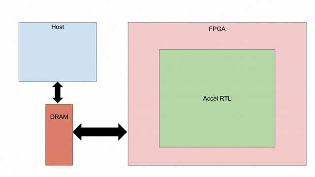

1. Hello, Spatial!
==================

Catalog of Features
-------------------

In this section, you will learn about the following components in Spatial:

- Application skeleton (import statements, application creation, accel scope, host scope)

- DRAM
 
- SRAM

- ArgIn
 
- ArgOut
 
- HostIO
  
- Reg
 
- Typing system

- Data transfer between host and accel (setArg, setMem, getArg, getMem, load, store, gather, scatter)
 
- Basic debugging hooks
 
- Compiling an app

Application Overview
--------------------

In this section, you will see how to put together the bare-minimum Spatial application.  While the
code does not do any "meaningful" work, it demonstrates the basic primitives that almost all applications 
have and is intended to be the "Hello, world!" program for hardware.  You will start by generating input and
output registers to get the accelerator and host to interact with each other, and then add tile transfers
between the off-chip DRAM and on-chip SRAM.  You will then learn what functions are provided to test
functionality and utilize the host.  Finally, you will learn the basic compilation flows for testing the
functionality of the algorithm, cycle-accurate simulation of the generated RTL, and bitstream generation to
deploy to a supported FPGA or architecture.  

Below is a visualization of what we will be doing in this tutorial.  We start with a host and an FPGA, both 
connected to DRAM.  We will then instantiate all of the different ways you can get the two processors to interact
with each other.  We will create an RTL that will sit inside the FPGA, as well as some C++ code that will sit inside
the host.  Spatial automatically instantiates a box called "Fringe," which is an FPGA-agnostic hardware design
that allows the RTL to interact with peripherals, DRAM, PCIe buses, and whatever else is available on a given
SoC or FPGA board.

Application Template
---------------------

All Spatial programs have a few basic components. The following code example shows each of those components for
an application that is called `HelloSpatial`::

    import spatial.dsl._
    import virtualized._

    object HelloSpatial extends SpatialApp {

      @virtualize
      def main() {

        Accel {

        }

      }
    }

Compiling and Testing
---------------------

We will use the above template to learn the process for compiling, simulating, and synthesizing a design.  
While this template is empty, you can use this same flow freely as you build your applications in the tutorials below.

.. highlight:: bash

Currently, you should edit and place apps inside of your `spatial-lang/apps/src/` directory.  Copy-paste the above
template into a new file in this directory and you are ready to compile.

For information on how to compile your app to a specific target, see the `targets <../targets.html>`_ page.
We recommend beginnig with either the Scala or VCS backends.

DRAM Transfers
--------------

We will now continue developing a Spatial app based on the above skeleton.
Please see the end of this section for a complete, copy-paste version of the code outlined below.

We will now add the code that will allow us to **1)** create data inside the host, **2)** transfer
this data to DRAM where it can be acessed by the FPGA, **3)** load the data, **4)** interact with the data
in on-chip SRAM, and **5)** store the data back to DRAM where it can be accessed by the host.

First, let's create a few data structures inside `main`, above the `Accel` block::
    
        val data1D        = Array.tabulate(64){i => i * 3} // Create 1D array with 64 elements, each element being index * 3
        val data1D_longer = Array.tabulate(1024){i => i} // Create 1D array with 1024 elements
        val data2D        = (0::64, 0::64){(i,j) => i*100 + j} // Create 64x64 2D, where each element is row * 100 + col
        val data5D        = (0::2, 0::2, 0::2, 0::2, 0::16){(i,j,k,l,m) => random[Int](5)} // Create 5D tensor, the highest dimension tensor currently supported in Spatial, with each element a random Int between 0 and 5

Now, let's allocate space in DRAM to memcpy this data to, so that the FPGA can read it later.  This code also lives above the `Accel` block::

        val dram1D        = DRAM[Int](64)
        val dram1D_longer = DRAM[Int](1024)
        val dram2D        = DRAM[Int](64,64)
        val dram5D        = DRAM[Int](2,2,2,2,16)

Next, we can transfer our generated data into these DRAM allocations, still above the `Accel` block::

        setMem(dram1D, data1D)
        setMem(dram1D_longer, data1D_longer)
        setMem(dram2D, data2D)
        setMem(dram5D, data5D)

We can also create a few DRAMs that will be written to by the Accel::
        
        val dram_result2D = DRAM[Int](32,32)
        val dram_scatter1D = DRAM[Int](1024)

Now, we will move into the `Accel` block to create some SRAMs to catch and hold data on-chip::

        val sram1D        = SRAM[Int](64)
        val sram2D        = SRAM[Int](32,32)
        val sram5D        = SRAM[Int](2,2,2,2,16)

With these SRAMs declared, we can load data into them.  DRAM is burst-addressable, relatively slow memory.  The Fringe module
manages the command and data streams that connect the FPGA to DRAM::

        sram1D load dram1D // Load data from a DRAM of matching dimension
        sram2D load dram2D(32::64, 0::32 par 16) // Load region from DRAM. In this case, we load the bottom-left quadrant of data from dram2D
        sram5D load dram5D // Load 5D tensor

In the above snippet, notice that you can parallelize these operations.  Parallelization of the leading dimension of the load
into the 2D SRAM means that rather than funnelling a 512-bit burst (consisting of 16 ints that are 32 bits each) into 1 element
at a time, we can store 16 elements at a time (the entire burst) into SRAM at once with each incoming burst.

Storing data from SRAM back into DRAM is straightforward, and can also have parallelization::

        dram_result2D(0::32, 0::32 par 8) store sram2D

The Fringe module also makes it very straightfoward to do scatter and gather operations from DRAM.  Because DRAM is
burst-addressable, it can be very inefficient to interact with individual, non-consecutive addresses.  The scatter and 
gather templates instantiate the control logic, caches, and other support required to efficiently coalesce, manage, and 
interact with DRAM at the word level.

        val gathered_sram = SRAM[Int](64)  // Create SRAM to hold data
        gathered_sram gather dram1D_longer(sram1D par 1, 64)  // Use the first 64 elements in sram1D as the addresses in dram1D_longer to collect, and store them into gathered_sram

We can also scatter this data back into DRAM

        dram_scatter1D(sram1D par 1, 64) scatter gathered_sram // For the first 64 elements, place element i of gathered_sram into the address indicated by the i'th element of sram1D 

Now, let's move outside the Accel and load our data back into the host to check if it is correct::
    
        val result_scattered = getMem(dram_scatter1D)
        val result2D = getMatrix(dram_result2D) // Collect 2D dram as a "Matrix."  Likewise, 3, 4, and 5D regions use "getTensor3", "getTensor4", and "getTensor5"

Finally, let's check if the data is correct and print the results. Note that while print lines inside the host code
will print for both the Scala and RTL backends, print lines inside the Accel will only print in the Scala backend and will be
ignored in RTL, since there is no straightforward print for FPGAs::
    
        printMatrix(result2D, "Result 2D: ") // printTensor3, printTensor4, and printTensor5 also exist
        printArray(result_scattered, "Result Scattered: ")
        val gold_2D = (32::64, 0::32){(i,j) => i*100 + j} // Remember we took bottom-left corner
        val cksum_2D = gold_2D.zip(result2D){_==_}.reduce{_&&_} // Zip the gold with the result and check if they are all equal
        val cksum_scattered = Array.tabulate(64){i => result_scattered(3*i) == 3*i}.reduce{_&&_} // Check if every 3 entries is equal to the index
        println("2D pass? " + cksum_2D)
        println("scatter pass? " + cksum_scattered)

Congratulations!  You have completed the DRAM section of the tutorial.  Refer back to the `targets <../targets.html>`_ section for a refresher on how to test your app.

Below is a copy-pastable version of the code outlined above::

    import spatial.dsl._
    import virtualized._

    object HelloSpatial extends SpatialApp {

      @virtualize
      def main() {

        val data1D        = Array.tabulate(64){i => i * 3} // Create 1D array with 64 elements, each element being index * 3
        val data1D_longer = Array.tabulate(1024){i => i} // Create 1D array with 1024 elements
        val data2D        = (0::64, 0::64){(i,j) => i*100 + j} // Create 64x64 2D, where each element is row * 100 + col
        val data5D        = (0::2, 0::2, 0::2, 0::2, 0::16){(i,j,k,l,m) => random[Int](5)} // Create 5D tensor, the highest dimension tensor currently supported in Spatial, with each element a random Int between 0 and 5

        val dram1D        = DRAM[Int](64)
        val dram1D_longer = DRAM[Int](1024)
        val dram2D        = DRAM[Int](64,64)
        val dram5D        = DRAM[Int](2,2,2,2,16)

        setMem(dram1D, data1D)
        setMem(dram1D_longer, data1D_longer)
        setMem(dram2D, data2D)
        setMem(dram5D, data5D)

        val dram_result2D = DRAM[Int](32,32)
        val dram_scatter1D = DRAM[Int](1024)

        Accel {
          val sram1D        = SRAM[Int](64)
          val sram2D        = SRAM[Int](32,32)
          val sram5D        = SRAM[Int](2,2,2,2,16)

          sram1D load dram1D // Load data from a DRAM of matching dimension
          sram2D load dram2D(32::64, 0::32 par 16) // Load region from DRAM. In this case, we load the bottom-left quadrant of data from dram2D
          sram5D load dram5D // Load 5D tensor

          dram_result2D(0::32, 0::32 par 8) store sram2D

          val gathered_sram = SRAM[Int](64)  // Create SRAM to hold data
          gathered_sram gather dram1D_longer(sram1D par 1, 64)  // Use the first 64 elements in sram1D as the addresses in dram1D_longer to collect, and store them into gathered_sram

          dram_scatter1D(sram1D par 1, 64) scatter gathered_sram // For the first 64 elements, place element i of gathered_sram into the address indicated by the i'th element of sram1D 
        }

        val result_scattered = getMem(dram_scatter1D)
        val result2D = getMatrix(dram_result2D) // Collect 2D dram as a "Matrix."  Likewise, 3, 4, and 5D regions use "getTensor3D", "getTensor4D", and "getTensor5D"

        printMatrix(result2D, "Result 2D: ")
        printArray(result_scattered, "Result Scattered: ")
        val gold_2D = (32::64, 0::32){(i,j) => i*100 + j} // Remember we took bottom-left corner
        val cksum_2D = gold_2D.zip(result2D){_==_}.reduce{_&&_} // Zip the gold with the result and check if they are all equal
        val cksum_scattered = Array.tabulate(64){i => result_scattered(3*i) == 3*i}.reduce{_&&_} // Check if every 3 entries is equal to the index
        println("2D pass? " + cksum_2D)
        println("scatter pass? " + cksum_scattered)
      }
    }

ArgIn/Out Interfaces and Typing
-------------------------------

We will now continue developing our Spatial app above and add ArgIns, ArgOuts, HostIOs, and Regs.

While most data that people want to process reside inside of DRAM data structures, there are times
when you may want to pass individual arguments between the Accel and the host.  Some examples include
passing parameters to the Accel, such as a damping factor in an algorithm like PageRank or data structure 
dimensions in an algorithm like GEMM, as well as passing parameters to the host in algorithms like 
Dot Product.  Let us define a few of these registers above the Accel block inside the ``main()`` function::

    val argin1 = ArgIn[Int]   // Register that is written to by the host and read from by the Accel
    val argout1 = ArgOut[Int] // Register that is written to by the Accel and read from by the host
    val io1 = HostIO[Int]     // Register that can be both written to and read from by the Accel and the host

By this point, you have probably noticed that we keep specifying everything as an Int in square brackets.  These 
square brackets are how Scala passes along type arguments.  Spatial is a hardware language that supports a few
types besides 32-bit integers and you can define them as follows::

    type T = FixPt[FALSE, _16, _16] // 32-bit unsigned integer with 16 whole bits and 16 fractional bits.
    type Flt = Float // 32-bit standard Float

Now we can make another argument using the T type::

    val argin2 = ArgIn[T]

Now that we have created these registers, we can load values into them::

    setArg(argin1, args(0).to[Int]) // Set argument with the first command-line value
    setArg(argin2, 7.to[T]) // Args do not necessarily need to be set with command-line values
    setArg(io1, args(1).to[Int])

Let's move into the Accel and interact with these registers::

    val reg1 = Reg[Int](5) // Create register with initial value of 5
    val reg2 = Reg[T] // Default initial value for a Reg is 0
    Pipe{reg1 := argin1} // Load from ArgIn
    Pipe{reg2 := argin2} // Load from ArgIn
    argout1 := reg1 + reg2.value.to[Int] // Cast the value in reg2 to Int and add it to reg1
    io1 := reg1

In the snippet above, you may notice that there are two Pipes.  This is the first example of where
the user must be aware of the hardware to understand what logic is actually getting generated.  The 
compiler scopes code into separate Blocks.  Before this point, we have not scoped any code into anything other
than the base, global block, meaning all of the hardware we generate will fire at the same time.  In this particular
example, we want ``reg1`` and ``reg2`` to be loaded before we sum them up, and therefore we should scope them out 
with ``Pipe`` in order to ensure the top-level controller will execute them one after another.  Note that if retiming is turned on
(see :doc:`compiler flags <../compiler>`), then we would not need to scope these operations out because all primitives
inside of a block are retimed appropriately to ensure their values arrive as dictated by the code.  Without retiming, however,
all primitives can happen simultaneously and give an incorrect result.  Later sections will discuss retiming and 
controller hierarchies further.

Now we can move outside the Accel and read the arg values::

    val result1 = getArg(argout1)
    val result2 = getArg(io1)

    println("Received " + result1 + " and " + result2)
    val cksum = (result1 == {args(0).to[Int] + args(1).to[Int]}) && (result2 == args(0).to[Int]) // The {} brackets are Scala's way of scoping operations
    println("ArgTest pass? " + cksum)

Congratulations!  You have completed the ArgIn/Out section of the tutorial.  Refer back to the `targets <../targets.html>`_ section for a refresher on how to test your app.

Final Code
----------

Below is a copy-pastable version of the code outlined above::

    import spatial.dsl._
    import virtualized._

    object HelloSpatial extends SpatialApp {

      @virtualize
      def main() {

        val argin1 = ArgIn[Int]   // Register that is written to by the host and read from by the Accel
        val argout1 = ArgOut[Int] // Register that is written to by the Accel and read from by the host
        val io1 = HostIO[Int]     // Register that can be both written to and read from by the Accel and the host

        type T = FixPt[FALSE, _16, _16] // 32-bit unsigned integer with 16 whole bits and 16 fractional bits.
        type Flt = Float // 32-bit standard Float

        val argin2 = ArgIn[T]

        setArg(argin1, args(0).to[Int]) // Set argument with the first command-line value
        setArg(argin2, 7.to[T]) // Args do not necessarily need to be set with command-line values
        setArg(io1, args(1).to[Int])

        val data1D        = Array.tabulate(64){i => i * 3} // Create 1D array with 64 elements, each element being index * 3
        val data1D_longer = Array.tabulate(1024){i => i} // Create 1D array with 1024 elements
        val data2D        = (0::64, 0::64){(i,j) => i*100 + j} // Create 64x64 2D, where each element is row * 100 + col
        val data5D        = (0::2, 0::2, 0::2, 0::2, 0::16){(i,j,k,l,m) => random[Int](5)} // Create 5D tensor, the highest dimension tensor currently supported in Spatial, with each element a random Int between 0 and 5

        val dram1D        = DRAM[Int](64)
        val dram1D_longer = DRAM[Int](1024)
        val dram2D        = DRAM[Int](64,64)
        val dram5D        = DRAM[Int](2,2,2,2,16)

        setMem(dram1D, data1D)
        setMem(dram1D_longer, data1D_longer)
        setMem(dram2D, data2D)
        setMem(dram5D, data5D)

        val dram_result2D = DRAM[Int](32,32)
        val dram_scatter1D = DRAM[Int](1024)

        Accel {
          val sram1D        = SRAM[Int](64)
          val sram2D        = SRAM[Int](32,32)
          val sram5D        = SRAM[Int](2,2,2,2,16)

          sram1D load dram1D // Load data from a DRAM of matching dimension
          sram2D load dram2D(32::64, 0::32 par 16) // Load region from DRAM. In this case, we load the bottom-left quadrant of data from dram2D
          sram5D load dram5D // Load 5D tensor

          dram_result2D(0::32, 0::32 par 8) store sram2D

          val gathered_sram = SRAM[Int](64)  // Create SRAM to hold data
          gathered_sram gather dram1D_longer(sram1D par 1, 64)  // Use the first 64 elements in sram1D as the addresses in dram1D_longer to collect, and store them into gathered_sram

          dram_scatter1D(sram1D par 1, 64) scatter gathered_sram // For the first 64 elements, place element i of gathered_sram into the address indicated by the i-th element of sram1D 

          val reg1 = Reg[Int](5) // Create register with initial value of 5
          val reg2 = Reg[T] // Default initial value for a Reg is 0
          Pipe{reg1 := argin1} // Load from ArgIn
          Pipe{reg2 := argin2} // Load from ArgIn
          argout1 := reg1 + reg2.value.to[Int] // Cast the value in reg2 to Int and add it to reg1
          io1 := reg1
        }

        val result_scattered = getMem(dram_scatter1D)
        val result2D = getMatrix(dram_result2D) // Collect 2D dram as a "Matrix."  Likewise, 3, 4, and 5D regions use "getTensor3D", "getTensor4D", and "getTensor5D"

        printMatrix(result2D, "Result 2D: ")
        printArray(result_scattered, "Result Scattered: ")
        val gold_2D = (32::64, 0::32){(i,j) => i*100 + j} // Remember we took bottom-left corner
        val cksum_2D = gold_2D.zip(result2D){_==_}.reduce{_&&_} // Zip the gold with the result and check if they are all equal
        val cksum_scattered = Array.tabulate(64){i => result_scattered(3*i) == 3*i}.reduce{_&&_} // Check if every 3 entries is equal to the index
        println("2D pass? " + cksum_2D)
        println("scatter pass? " + cksum_scattered)

        val result1 = getArg(argout1)
        val result2 = getArg(io1)

        println("Received " + result1 + " and " + result2)
        val cksum = (result1 == {args(0).to[Int] + args(1).to[Int]}) && (result2 == args(0).to[Int]) // The {} brackets are Scala's way of scoping operations
        println("ArgTest pass? " + cksum)

      }
    }

Stream Interfaces
-----------------

** This section is still under construction **

Finally, you will see how to create stream interfaces with peripheral devices that your FPGA
may have access to.  Generally, these involve LEDs, switches, buttons, GPIO pins, ADC streams, and
sensor interfaces.  A stream interface looks like exposed signal pins inside the FPGA and there may
or may not be ready/valid signals routed alongside them.  For example, switches are input streams that
are always valid and LEDs are output streams that are always ready.  A pixel buffer that may come with
an ADC stream will likely have a `valid` signal to indicate to the Accel that there is data ready to be
dequeued, and the FPGA would need to send back a `ready` signal to indicate that it is ready to 
receive and process new data.

These protocols are abstracted away by the compiler and all the user needs to do is instantiate the 
interfaces and use them in the code inside of the appropriate control structures.

Below are some examples on how to use stream interfaces for some peripherals available on
the DE1SoC::

    val imgIn  = StreamIn[Pixel16](target.VideoCamera) // Input stream for camera
    val imgOut = BufferedOut[Pixel16](target.VGA) // Output VGA display
    val switch = target.SliderSwitch
    val swInput = StreamIn[sw3](switch)

More on stream interfaces TBA.

Next, :doc:`learn how to build a more complicated Spatial app, Dot Product <dotproduct>`.

